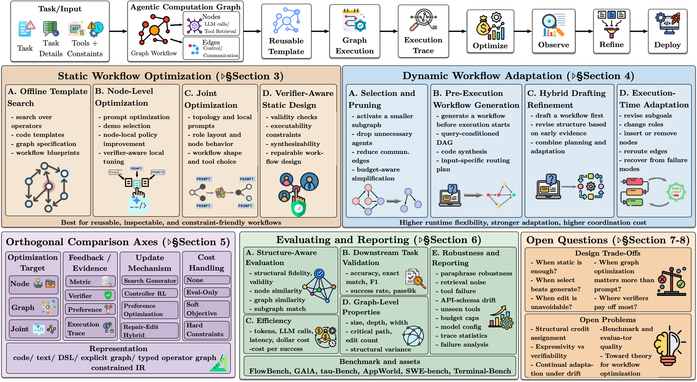

# Awesome Workflow Optimization for LLM Agents

A curated list of papers on workflow optimization for LLM agents.

This repository accompanies the survey paper **From Static Templates to Dynamic Runtime Graphs: A Survey of Workflow Optimization for LLM Agents**.  
Survey paper: [From Static Templates to Dynamic Runtime Graphs: A Survey of Workflow Optimization for LLM Agents](https://doi.org/10.13140/RG.2.2.23159.48806)



This list focuses on papers whose main contribution is workflow optimization. To keep the repository concise and method-centric, it does not aim to cover general survey papers, benchmarks, datasets, or framework/tooling papers.

The list is organized by **when workflow structure is determined**: static optimization and dynamic optimization.

## Table of Contents

- [Static Optimization](#static-optimization)
  - [Offline template search over constrained design spaces](#offline-template-search-over-constrained-design-spaces)
  - [Node-level optimization inside fixed scaffolds](#node-level-optimization-inside-fixed-scaffolds)
  - [Joint optimization of structure and local configuration](#joint-optimization-of-structure-and-local-configuration)
  - [Verifiability in static workflow optimization](#verifiability-in-static-workflow-optimization)
- [Dynamic Optimization and Runtime Adaptation](#dynamic-optimization-and-runtime-adaptation)
  - [Selection and pruning as the lightest form of runtime adaptation](#selection-and-pruning-as-the-lightest-form-of-runtime-adaptation)
  - [Construct-then-execute: pre-execution workflow generation](#construct-then-execute-pre-execution-workflow-generation)
  - [In-execution editing: interleaving execution with structural change](#in-execution-editing-interleaving-execution-with-structural-change)
- [Contributing](#contributing)
- [Citation](#citation)
- [Star History](#star-history)

## Static Optimization

### Offline template search over constrained design spaces

| Title | Year | Paper |
| --- | --- | --- |
| AFlow: Automating Agentic Workflow Generation | 2025 | [Link](https://openreview.net/forum?id=z5uVAKwmjf) |
| Automated Design of Agentic Systems | 2025 | [Link](https://openreview.net/forum?id=t9U3LW7JVX) |
| A²Flow: Automating Agentic Workflow Generation via Self-Adaptive Abstraction Operators | 2025 | [Link](https://arxiv.org/abs/2511.20693) |
| SEW: Self-Evolving Agentic Workflows for Automated Code Generation | 2025 | [Link](https://arxiv.org/abs/2505.18646) |
| Evolutionary Generation of Multi-Agent Systems | 2026 | [Link](https://arxiv.org/abs/2602.06511) |

### Node-level optimization inside fixed scaffolds

| Title | Year | Paper |
| --- | --- | --- |
| DSPy: Compiling Declarative Language Model Calls into Self-Improving Pipelines | 2023 | [Link](https://arxiv.org/abs/2310.03714) |
| Large Language Models as Optimizers | 2023 | [Link](https://arxiv.org/abs/2309.03409) |
| EvoPrompt: Connecting LLMs with Evolutionary Algorithms Yields Powerful Prompt Optimizers | 2023 | [Link](https://arxiv.org/abs/2309.08532) |
| CAPO: Cost-Aware Prompt Optimization | 2025 | [Link](https://arxiv.org/abs/2504.16005) |
| GEPA: Reflective Prompt Evolution Can Outperform Reinforcement Learning | 2025 | [Link](https://arxiv.org/abs/2507.19457) |
| Optima: Optimizing Effectiveness and Efficiency for LLM-Based Multi-Agent System | 2025 | [Link](https://aclanthology.org/2025.findings-acl.601/) |

### Joint optimization of structure and local configuration

| Title | Year | Paper |
| --- | --- | --- |
| Multi-Agent Design: Optimizing Agents with Better Prompts and Topologies | 2025 | [Link](https://arxiv.org/abs/2502.02533) |
| Learning Multi-Agent Communication from Graph Modeling Perspective | 2024 | [Link](https://arxiv.org/abs/2405.08550) |
| Maestro: Joint Graph & Config Optimization for Reliable AI Agents | 2025 | [Link](https://arxiv.org/abs/2509.04642) |

### Verifiability in static workflow optimization

| Title | Year | Paper |
| --- | --- | --- |
| MermaidFlow: Redefining Agentic Workflow Generation via Safety-Constrained Evolutionary Programming | 2025 | [Link](https://arxiv.org/abs/2505.22967) |
| VFlow: Discovering Optimal Agentic Workflows for Verilog Generation | 2025 | [Link](https://arxiv.org/abs/2504.03723) |

## Dynamic Optimization and Runtime Adaptation

### Selection and pruning as the lightest form of runtime adaptation

| Title | Year | Paper |
| --- | --- | --- |
| Cut the Crap: An Economical Communication Pipeline for LLM-Based Multi-Agent Systems | 2025 | [Link](https://openreview.net/forum?id=LkzuPorQ5L) |
| Adaptive Graph Pruning for Multi-Agent Communication | 2025 | [Link](https://arxiv.org/abs/2506.02951) |
| DAGP: Difficulty-Aware Graph Pruning for LLM-Based Multi-Agent Systems | 2025 | [Link](https://doi.org/10.1145/3746252.3760954) |
| AgentDropout: Dynamic Agent Elimination for Token-Efficient and High-Performance LLM-Based Multi-Agent Collaboration | 2025 | [Link](https://arxiv.org/abs/2503.18891) |
| A Dynamic LLM-Powered Agent Network for Task-Oriented Agent Collaboration | 2023 | [Link](https://arxiv.org/abs/2310.02170) |
| MasRouter: Learning to Route LLMs for Multi-Agent Systems | 2025 | [Link](https://aclanthology.org/2025.acl-long.757/) |
| SkillOrchestra: Learning to Route Agents via Skill Transfer | 2026 | [Link](https://arxiv.org/abs/2602.19672) |

### Construct-then-execute: pre-execution workflow generation

| Title | Year | Paper |
| --- | --- | --- |
| Difficulty-Aware Agentic Orchestration for Query-Specific Multi-Agent Workflows | 2025 | [Link](https://arxiv.org/abs/2509.11079) |
| Assemble Your Crew: Automatic Multi-Agent Communication Topology Design via Autoregressive Graph Generation | 2025 | [Link](https://arxiv.org/abs/2507.18224) |
| G-Designer: Architecting Multi-Agent Communication Topologies via Graph Neural Networks | 2025 | [Link](https://openreview.net/forum?id=LpE54NUnmO) |
| Dynamic Generation of Multi-LLM Agents Communication Topologies with Graph Diffusion Models | 2025 | [Link](https://arxiv.org/abs/2510.07799) |
| Multi-Agent Architecture Search via Agentic Supernet | 2025 | [Link](https://openreview.net/forum?id=imcyVlzpXh) |
| ScoreFlow: Mastering LLM Agent Workflows via Score-Based Preference Optimization | 2025 | [Link](https://arxiv.org/abs/2502.04306) |
| FlowReasoner: Reinforcing Query-Level Meta-Agents | 2025 | [Link](https://arxiv.org/abs/2504.15257) |
| Workflow-R1: Group Sub-sequence Policy Optimization for Multi-Turn Workflow Construction | 2026 | [Link](https://arxiv.org/abs/2602.01202) |
| AutoFlow: Automated Workflow Generation for Large Language Model Agents | 2024 | [Link](https://arxiv.org/abs/2407.12821) |
| WorkflowLLM: Enhancing Workflow Orchestration Capability of Large Language Models | 2024 | [Link](https://arxiv.org/abs/2411.05451) |
| RobustFlow: Towards Robust Agentic Workflow Generation | 2025 | [Link](https://arxiv.org/abs/2509.21834) |
| ComfyUI-R1: Exploring Reasoning Models for Workflow Generation | 2025 | [Link](https://arxiv.org/abs/2506.09790) |
| AutoAgents: A Framework for Automatic Agent Generation | 2024 | [Link](https://www.ijcai.org/proceedings/2024/3) |

### In-execution editing: interleaving execution with structural change

| Title | Year | Paper |
| --- | --- | --- |
| DyFlow: Dynamic Workflow Framework for Agentic Reasoning | 2025 | [Link](https://arxiv.org/abs/2509.26062) |
| AgentConductor: Topology Evolution for Multi-Agent Competition-Level Code Generation | 2026 | [Link](https://arxiv.org/abs/2602.17100) |
| Aime: Towards Fully-Autonomous Multi-Agent Framework | 2025 | [Link](https://arxiv.org/abs/2507.11988) |
| AOrchestra: Automating Sub-Agent Creation for Agentic Orchestration | 2026 | [Link](https://arxiv.org/abs/2602.03786) |
| MetaGen: Self-Evolving Roles and Topologies for Multi-Agent LLM Reasoning | 2026 | [Link](https://arxiv.org/abs/2601.19290) |
| ProAgent: From Robotic Process Automation to Agentic Process Automation | 2023 | [Link](https://arxiv.org/abs/2311.10751) |
| Flow: Modularized Agentic Workflow Automation | 2025 | [Link](https://openreview.net/forum?id=sLKDbuyq99) |
| EvoFlow: Evolving Diverse Agentic Workflows on the Fly | 2025 | [Link](https://arxiv.org/abs/2502.07373) |
| DebFlow: Automating Agent Creation via Agent Debate | 2025 | [Link](https://arxiv.org/abs/2503.23781) |
| QualityFlow: An Agentic Workflow for Program Synthesis Controlled by LLM Quality Checks | 2025 | [Link](https://arxiv.org/abs/2501.17167) |


## Contributing

Contributions are welcome.

Please edit `README.md` directly and follow these rules:

1. Only include papers whose main contribution is workflow optimization.
2. Put each paper in exactly one subsection.
3. Prefer official paper pages.
4. Keep the table format as `Title | Year | Paper`.
5. If a paper could fit multiple subsections, place it in the subsection that best matches its main contribution.

## Citation

If you find this repository or the accompanying survey helpful, please cite:

```bibtex
@article{yue2026workflowsurvey,
  title        = {From Static Templates to Dynamic Runtime Graphs: A Survey of Workflow Optimization for LLM Agents},
  author       = {Yue, Ling and Bhandari, Kushal Raj and Ko, Ching-Yun and Patel, Dhaval and Lin, Shuxin and Zhou, Nianjun and Gao, Jianxi and Chen, Pin-Yu and Pan, Shaowu},
  year         = {2026},
  note         = {Preprint},
  doi          = {10.13140/RG.2.2.23159.48806},
  url          = {https://doi.org/10.13140/RG.2.2.23159.48806}
}
```

## Star History

[](https://www.star-history.com/#IBM/awesome-agentic-workflow-optimization&Date)
